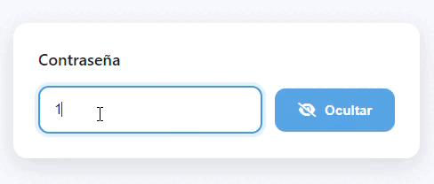

# Campo de Contraseña Animado

Componente moderno de entrada de contraseña desarrollado con React, que incluye una animación distintiva de caracteres al alternar la visibilidad del texto.

## Características Principales

- Interfaz minimalista con animaciones fluidas
- Transición de caracteres al mostrar/ocultar contraseña
- Diseño responsivo y adaptable
- Efectos visuales de interacción
- Validación de entrada en tiempo real

## Tecnologías

- React 18.0
- CSS3 Moderno
- Font Awesome 6
- Babel (Compilación JSX)